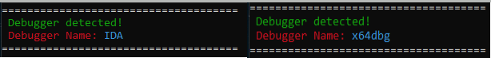

# debugger-detector

A study project exploring Windows anti-debug techniques in C++.

## What it does

Detects when the program is being debugged and exits cleanly. Each
detector is a separate, self-contained check.

## Features

* IsDebuggerPresent check (PEB flag)
* DebugBreak + SEH check
* Suspicious process scan (x64dbg, IDA, Cheat Engine, etc.)
* Suspicious window title scan
* Suspicious driver scan (KsDumper, etc.)
* NT API checks (NtQueryInformationProcess, ZwQuerySystemInformation)
* Thread hiding via NtSetInformationThread
* PE header erase (anti-dump)
* Compile-time string obfuscation with XorStr
* Colored console output for clearer debug logs

## Demo

I came across some anti-debugger projects online and wanted to actually
understand how the techniques work not just copy them. So I rewrote
them from scratch, restructured the code, and removed the parts I
didn't want (no BSOD, no process killing, just detection and exit).

This is a learning project. Not for production use.
